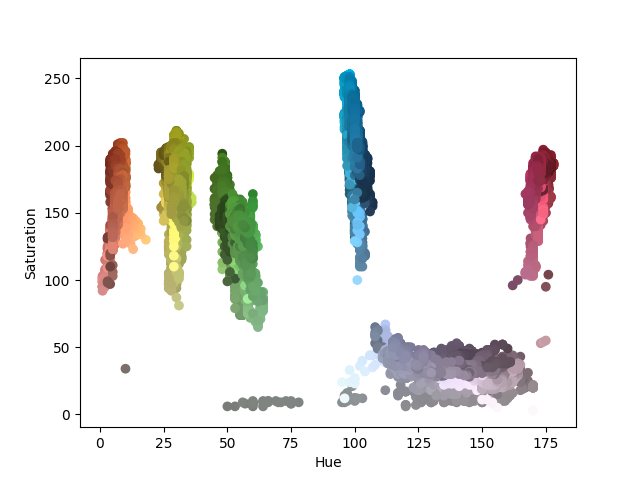

# Rubiksolver

https://github.com/user-attachments/assets/437902a8-08ce-4c79-a4a9-40c0c7fcf09c

▶️ [Watch the Demo on YouTube](https://www.youtube.com/watch?v=abj7ubu9g8o)

______________________________________________________________________

## Description

**Rubiksolver** is a simple GUI-based computer vision application that detects
and solves a Rubik’s Cube in real time.

______________________________________________________________________

## Computer Vision Pipeline

I use **Canny edge detection** to extract individual facelets from the video frame.
To reliably distinguish cube facelets from background objects, the program only
accepts contours that meet specific **aspect-ratio** and **size thresholds**,
which are adjustable from the GUI.

To further eliminate erroneous facelet candidates, I project the candidates onto
a grid and select those with the lowest error after **100 RANSAC iterations**.

Finally, to correctly label each facelet by its face color, I use the **aggregate
mean hue and saturation** of its pixels to classify colors. I found this model
to be fairly robust and invariant to lighting changes compared to RGB-based approaches.



The figure above shows the aggregate mean hue and saturation of each facelet’s
pixels across multiple runs under different lighting conditions.
As you can see, a very simple thresholding model suffices to classify each
facelet by color.

______________________________________________________________________

## Installation

To run the app, you’ll need to have [`uv`](https://docs.astral.sh/uv/)
installed on your system.
If you don’t already have it, follow the
[installation instructions here](https://docs.astral.sh/uv/getting-started/installation/).

```bash
git clone https://github.com/pdadhikary/rubiksolver.git
cd rubiksolver
uv sync
```

The above commands will clone the repository and install all required
dependencies in a virtual Python environment.
Once setup is complete, you can start the program with:

```bash
uv run rubiksolver
```
